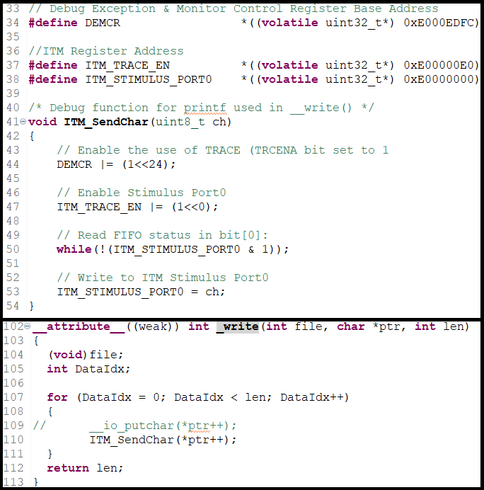
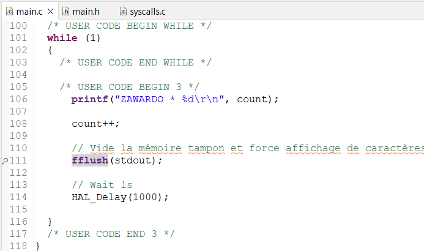
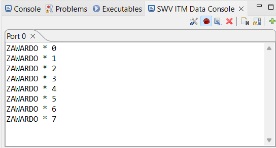

# Serial_Wire_Viewer  
This project goal is to use Serial Wire Viewer to use printf().  
You must : 
- Configure **DEMCR** (Debug Exception & Monitor Control Register)
- Configure **ITM** (Instrumentation Trace Macrocell) trace enable register
- Configure **ITM** (Instrumentation Trace Macrocell) stimulus port register 
- Create a function ITM_SendChar() to send char via ITM
- In *Core/Src/syscalls.c/_write()*, replace ***__io_putchar()*** by ***ITM_SendChar()***
- Configure the debug settings

>### Follow those steps to configure the registers :
>- Add the 32-bits **DEMCR**  in *Core/Src/syscalls.c*   
>See the address of the register in the *Cortex-M4 Technical Reference Manual*.
>- Add the 32-bits **ITM** trace enable register in *Core/Src/syscalls.c*   
>See the address of the register in the *STM32F411xC/E Reference Manual*.
>- Add the 32-bits **ITM** stimulus port_0 register in *Core/Src/syscalls.c*   
>See the address of the register in the *STM32F411xC/E Reference Manual*.

>### Follow those steps to create ITM_SendChar() :
>- Enable the use of a TRACE by setting **TRCENA** bit (24th bit in the **DEMCR** register )  
>See the position of **TRCENA** bit in the *Armv7-M Architecture Reference Manual* 
>- Enable the stimulus of port 0 by setting bit 1 of **ITM** trace enable register  
>See in the *Armv7-M Architecture Reference Manual*
>- Read the **FIFOREADY** bit of the **ITM** stimulus port_0 register  
>See the position of **FIFOREADY** bit *Armv7-M Architecture Reference Manual*
>- Write char to the **ITM** stimulus port_0 register  

main.c :  

>### Follow those steps to configure the debug settings
>- In *Edit Configuration* go to *Debugger* tab and :
>   - In *Interface* panel, check *ST-LINK S/N* and scan signature on USB
>   - In *Serial Wire Viewer (SWV)* panel, check *Enable*  
>   - Apply modifications 
>- Configure SWV ITM Data Console :
>   - Go to Windows -> Show View -> SWV -> SWV ITM Data Console 
>   - Click on **Configure trace** in *SWV ITM Data Console* new tab
>   - In ITM Stimulus Ports panel, select port 0 by checking the 1st bit (bit[0]) 
>   - Click on **Start Trace**
>   - Press F8 or click on **Resume debug**
>   - Enjoy

## Result  

